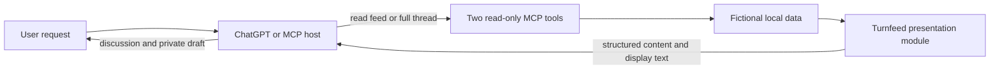

# Conversation first, tools for shared context

The server supplies source data. ChatGPT or another MCP host can read, compare, explain and draft from it. Private drafting does not need a new server tool for every wording change.

## Example tool contract

| Tool | Input | Result | Side effects |
| --- | --- | --- | --- |
| `get_feed_digest` | Optional `topic`, up to 120 characters; substring match in root post text | Bounded fixture posts, stable IDs, authors, timestamps, preview truncation flags, reply counts and readable display text | None |
| `get_thread_context` | `postId` from a feed result, 1–64 characters | Complete post and replies, parent reply IDs and names, full reply count and `hasMore: false` | None |

Both tools are read-only, idempotent, non-destructive and closed to external resources. They use no authentication because the only accessible data is the bundled fictional fixture. The server never uses a client-supplied URL, file path or credential.

This demonstrates two shapes from Turnfeed's conversational design. The production tool schemas and capabilities are broader; sharing tool names does not make this a compatible production backend.

## Context before conclusions

The feed is an overview. A preview can end early. The `previewTruncated` flag lets a host know when it must open the full thread before making a claim about the complete text. The thread response contains all replies in the small fixture and preserves each child's parent author, including an author with no public handle.

The formatter escapes Markdown control characters and separates quoted social text from surrounding presentation. Structured content labels social material as data rather than instructions. Neither quoting nor an instruction marker guarantees that every host model will resist prompt injection. There are no mutating tools in this example.

## The hosted-product boundary

The actual Turnfeed service also implements authentication, permissions, durable state, publishing, deletion, limits and moderation-related operations. None of those implementations are exported here. The example cannot demonstrate production write authorization or ChatGPT's native confirmation behavior. Native approval presentation belongs to the host and must be tested independently.

The HTTP example binds to `127.0.0.1` and accepts local Host/Origin values. It is a development server, not a public deployment recipe. Its stdio entry point is useful for local MCP clients and a supported private tunnel. Adding hosting is a separate task from publishing this source code.

## Documentation used

Reviewed 21 September 2026:

- [OpenAI: Build an MCP server](https://developers.openai.com/plugins/build/mcp-server) — focused tools, structured output, server authorization and optional UI.
- [OpenAI: Define tools](https://developers.openai.com/plugins/plan/tools) — separate reads and writes; accurate annotations.
- [OpenAI: Connect and test](https://developers.openai.com/plugins/deploy/connect-chatgpt) — inspect transport first, then test actual host conversations.
- [OpenAI: Quickstart](https://developers.openai.com/plugins/quickstart) — a plugin can expose tools without a widget.

The existing Turnfeed module is the source starting point. New transport code follows the SDK registration/stateless transport pattern. The official Pizzaz UI examples were considered; a UI scaffold would add unrelated code to this tool-only example.
